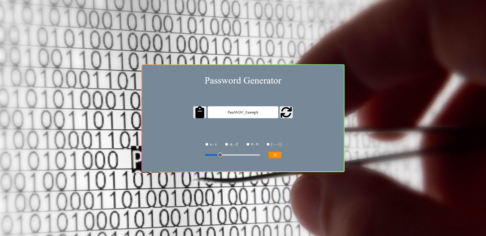

# Password generator / Générateur de mots de passe

## What is it ? / Qu'est ce que c'est ?

- A simple and nice password generator !

- **Un simple générateur de mots de passe !**

---

## How does it work? / Comment ça marche ?

- Clone the repo and launch it in the browser using [Live Server](https://marketplace.visualstudio.com/items?itemName=ritwickdey.LiveServer), nothing more, nothing less.

- **Cloner le repo et le lancer dans le navigateur à l'aide de [Live Server](https://marketplace.visualstudio.com/items?itemName=ritwickdey.LiveServer), ni plus ni moins.**

---

## What does it look like? A quoi ça ressemble ?

- **Here's an example of the app:** / **Voici un exemple de l'application :**

    

---

## Use cases  / Cas d'usages

- Quite simply, you choose your criteria and initiate the creation by pressing the arrow icon !

- **Tout simplement, vous choisissez vos critères et lancez la création en appuyant sur l'icône fléché !**

- For ease of use, a copy and paste button is available !

- **Pour faciliter son utilisation, un bouton "copier-coller" est disponible !**

- For info: This password generator is intended for computer use only (no media queries for the moment)

- **Pour information : Ce générateur de mots de passe est destiné à un usage informatique uniquement (pas de requêtes média pour le moment).**

---

## What next ? Et ensuite ?

- **Check my profil on [github](https://github.com/Youliix) and do not hesitate to leave a review by contacting me via email or linkedin !**

- **Consultez mon profil sur [github](https://github.com/Youliix) et n'hésitez pas à laisser un avis en me contactant via email ou linkedin !**
  
- **[email](math.baffoigne@gmail.com)**

- **[linkedin](www.linkedin.com/in/mathieu-baffoigne-b82985b6)**
